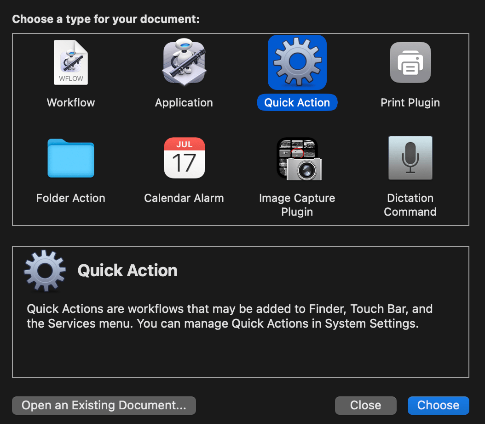

## macOS Integration: Automator Quick Actions

This guide explains how to integrate the `vid2gif_pro` script with macOS Finder, allowing you to convert videos to optimized GIFs or MP4s (H.264/H.265) directly from the right-click menu using Automator Quick Actions.

This method uses helper "wrapper" scripts for reliability, ensuring `ffmpeg`, `gifsicle`, and other necessary tools are found correctly.




### Prerequisites

1.  **`vid2gif_func.sh` Installed:** Ensure you have followed the main installation steps for the `vid2gif_pro` function, specifically that the `vid2gif_func.sh` file exists (e.g., at `~/.my_scripts/vid2gif_func.sh`).
2.  **`ffmpeg` & `gifsicle` Installed:** `ffmpeg` (with `x264`/`x265` libraries) and `gifsicle` (for GIF optimization) must be installed, typically via Homebrew (`brew install ffmpeg gifsicle`).
3.  **Text Editor:** You'll need a command-line text editor like `nano`.
4.  **Permissions:** You will need administrator privileges (`sudo`) to create files in `/usr/local/bin`.

### Step 1: Create Wrapper Scripts

We'll create separate scripts in `/usr/local/bin` for each conversion type (GIF, H.264, H.265). These scripts call your main `vid2gif_pro` function with specific settings.

**(A) Create GIF Wrapper Script (e.g., 1/3 Size):**

1.  Open the file in `nano`:
    ```bash
    sudo nano /usr/local/bin/vid2convert_wrapper_gif_third_size.sh
    ```

2.  Paste the following content:
    ```bash
    #!/bin/zsh
    # Wrapper script for GIF (1/3 size) conversion via vid2gif_pro

    # Ensure Homebrew executables are found
    export PATH="/opt/homebrew/bin:/usr/local/bin:$PATH"

    # Source the main function script (adjust path if needed)
    source "$HOME/.my_scripts/vid2gif_func.sh"

    # Process each file passed from Finder
    for f in "$@"
    do
      # --- Prepare output path ---
      dir=$(dirname "$f")
      filename_with_ext=$(basename "$f")
      base="${filename_with_ext%.*}"
      # Define output filename
      target_filename="${base}-third_size.gif"
      target_path="${dir}/${target_filename}"

      # --- Execute conversion ---
      # vid2gif_pro defaults to GIF if no --to-mp4-* flag is given
      # Add other GIF flags like --fps or --lossy here if desired
      vid2gif_pro --src "$f" --third-size --lossy --dither bayer --target "$target_path"
    done
    ```

3.  Save and exit `nano` (`Ctrl+X`, `Y`, `Enter`).

4.  Make the script executable:
    ```bash
    sudo chmod +x /usr/local/bin/vid2convert_wrapper_gif_third_size.sh
    ```

**(B) Create H.264 Wrapper Script:**

1.  Open the file in `nano`:
    ```bash
    sudo nano /usr/local/bin/vid2convert_wrapper_x264.sh
    ```

2.  Paste the following content:
    ```bash
    #!/bin/zsh
    # Wrapper script for H.264 conversion via vid2gif_pro

    export PATH="/opt/homebrew/bin:/usr/local/bin:$PATH"
    source "$HOME/.my_scripts/vid2gif_func.sh"

    for f in "$@"
    do
      # --- Prepare output path ---
      dir=$(dirname "$f")
      filename_with_ext=$(basename "$f")
      base="${filename_with_ext%.*}"
      # Define output filename
      target_filename="${base}-h264_crf29.mp4"
      target_path="${dir}/${target_filename}"

      # --- Execute conversion ---
      vid2gif_pro --src "$f" --to-mp4-h264 --crf 29 --target "$target_path"
    done
    ```

3.  Save and exit `nano`.

4.  Make the script executable:
    ```bash
    sudo chmod +x /usr/local/bin/vid2convert_wrapper_x264.sh
    ```

**(C) Create H.265 Wrapper Script:**

1.  Open the file in `nano`:
    ```bash
    sudo nano /usr/local/bin/vid2convert_wrapper_x265.sh
    ```

2.  Paste the following content:
    ```bash
    #!/bin/zsh
    # Wrapper script for H.265 conversion via vid2gif_pro

    export PATH="/opt/homebrew/bin:/usr/local/bin:$PATH"
    source "$HOME/.my_scripts/vid2gif_func.sh"

    for f in "$@"
    do
      # --- Prepare output path ---
      dir=$(dirname "$f")
      filename_with_ext=$(basename "$f")
      base="${filename_with_ext%.*}"
      # Define output filename
      target_filename="${base}-h265_crf31.mp4"
      target_path="${dir}/${target_filename}"

      # --- Execute conversion ---
      vid2gif_pro --src "$f" --to-mp4-h265 --crf 31 --target "$target_path"
    done
    ```

3.  Save and exit `nano`.

4.  Make the script executable:
    ```bash
    sudo chmod +x /usr/local/bin/vid2convert_wrapper_x265.sh
    ```

### Step 2: Create Automator Quick Actions

Now, create a Quick Action for each wrapper script.

**(A) Create GIF Quick Action:**

1.  Launch **Automator**.
2.  **File > New** (`⌘N`), choose **Quick Action**, click **Choose**.
3.  Configure workflow: "Workflow receives current" → `movie files` in `Finder`. *(Optional: Choose Image)*.
4.  Add the **Run Shell Script** action.
5.  Configure action: Shell → `/bin/zsh`, Pass input → `as arguments`.
6.  Script Code:
    ```bash
    /usr/local/bin/vid2convert_wrapper_gif_third_size.sh "$@"
    ```
7.  **File > Save** (`⌘S`). Name it (e.g., `Convert to GIF Third Size`).

**(B) Create H.264 Quick Action:**

1.  Launch **Automator**.
2.  **File > New** (`⌘N`), choose **Quick Action**, click **Choose**.
3.  Configure workflow: "Workflow receives current" → `movie files` in `Finder`. *(Optional: Choose Image)*.
4.  Add the **Run Shell Script** action.
5.  Configure action: Shell → `/bin/zsh`, Pass input → `as arguments`.
6.  Script Code:
    ```bash
    /usr/local/bin/vid2convert_wrapper_x264.sh "$@"
    ```
7.  **File > Save** (`⌘S`). Name it (e.g., `Convert to MP4 (H.264)`).

**(C) Create H.265 Quick Action:**

1.  Launch **Automator**.
2.  **File > New** (`⌘N`), choose **Quick Action**, click **Choose**.
3.  Configure workflow: "Workflow receives current" → `movie files` in `Finder`. *(Optional: Choose Image)*.
4.  Add the **Run Shell Script** action.
5.  Configure action: Shell → `/bin/zsh`, Pass input → `as arguments`.
6.  Script Code:
    ```bash
    /usr/local/bin/vid2convert_wrapper_x265.sh "$@"
    ```
7.  **File > Save** (`⌘S`). Name it (e.g., `Convert to MP4 (H.265)`).

### Usage

1.  Navigate to a video file (or select multiple) in Finder.
2.  Right-click (or Control-click) the selection.
3.  Hover over **Quick Actions**.
4.  Select the desired conversion: `Convert to GIF Third Size`, `Convert to MP4 (H.264)`, or `Convert to MP4 (H.265)`. To rename the Quick Actions, you can find the files in `/Users/youruser/Library/Services`

The conversion will start using the settings defined in the corresponding wrapper script, and the output file will be saved in the same directory as the source file.
