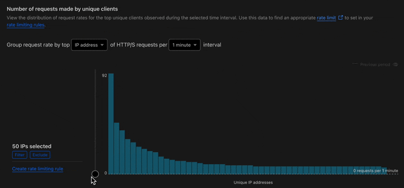

Video to GIF conversion for MacOS users inspired by https://gist.github.com/SheldonWangRJT/8d3f44a35c8d1386a396b9b49b43c385 discussion.

~~~bash
vid2gif_pro --src cloudflare-security-rate-limit-analysis-170425-0.mov --third-size --target cloudflare-security-rate-limit-analysis-170425-third-0.gif

Applying ~33% scaling (--third-size).
Pass 1: Generating palette (using filters: scale=iw/3:ih/3,fps=10)...
[Parsed_palettegen_2 @ 0x6000032a5970] The input frame is not in sRGB, colors may be off
    Last message repeated 308 times
Pass 2: Generating GIF using palette (dither: sierra2_4a)...
Optimizing 'cloudflare-security-rate-limit-analysis-170425-third-0.gif' with gifsicle...
Successfully created 'cloudflare-security-rate-limit-analysis-170425-third-0.gif'
~~~

`--third-size` output GIF

~~~bash
exiftool cloudflare-security-rate-limit-analysis-170425-third-0.gif
ExifTool Version Number         : 13.25
File Name                       : cloudflare-security-rate-limit-analysis-170425-third-0.gif
Directory                       : .
File Size                       : 900 kB
File Modification Date/Time     : 2025:04:17 15:56:18+10:00
File Access Date/Time           : 2025:04:17 16:04:54+10:00
File Inode Change Date/Time     : 2025:04:17 15:59:47+10:00
File Permissions                : -rw-r--r--
File Type                       : GIF
File Type Extension             : gif
MIME Type                       : image/gif
GIF Version                     : 89a
Image Width                     : 798
Image Height                    : 372
Has Color Map                   : Yes
Color Resolution Depth          : 8
Bits Per Pixel                  : 8
Background Color                : 6
Animation Iterations            : Infinite
XMP Toolkit                     : Image::ExifTool 12.60
X Resolution                    : 72
Y Resolution                    : 72
Transparent Color               : 0
Frame Count                     : 309
Duration                        : 30.90 s
Image Size                      : 798x372
Megapixels                      : 0.297
~~~



~~~bash
vid2gif_pro --src cloudflare-security-rate-limit-analysis-170425-0.mov --half-size --target cloudflare-security-rate-limit-analysis-170425-half-0.gif

Applying 50% scaling (--half-size).
Pass 1: Generating palette (using filters: scale=iw/2:ih/2,fps=10)...
[Parsed_palettegen_2 @ 0x60000367d6b0] The input frame is not in sRGB, colors may be off
    Last message repeated 308 times
Pass 2: Generating GIF using palette (dither: sierra2_4a)...
Optimizing 'cloudflare-security-rate-limit-analysis-170425-half-0.gif' with gifsicle...
Successfully created 'cloudflare-security-rate-limit-analysis-170425-half-0.gif'
~~~

~~~bash
vid2gif_pro --src cloudflare-security-rate-limit-analysis-170425-0.mov --target cloudflare-security-rate-limit-analysis-170425-0.gif

Converting 'cloudflare-security-rate-limit-analysis-170425-0.mov' to 'cloudflare-security-rate-limit-analysis-170425-0.gif'...
Parameters: FPS=10, Optimize=true
Using original resolution.
Executing FFMPEG command...
Optimizing 'cloudflare-security-rate-limit-analysis-170425-0.gif' with gifsicle...
gifsicle: warning: huge GIF, conserving memory (processing may take a while)
Successfully created 'cloudflare-security-rate-limit-analysis-170425-0.gif'
~~~

~~~bash
vid2gif_pro --src cloudflare-security-rate-limit-analysis-170425-1.mov --target cloudflare-security-rate-limit-analysis-170425-1.gif

Converting 'cloudflare-security-rate-limit-analysis-170425-1.mov' to 'cloudflare-security-rate-limit-analysis-170425-1.gif'...
Parameters: FPS=10, Optimize=true
Using original resolution.
Executing FFMPEG command...
Optimizing 'cloudflare-security-rate-limit-analysis-170425-1.gif' with gifsicle...
gifsicle: warning: huge GIF, conserving memory (processing may take a while)
Successfully created 'cloudflare-security-rate-limit-analysis-170425-1.gif'
~~~

~~~bash
ls -lah cloudflare-security*        
-rw-r--r--  1 username  staff   2.5M 17 Apr 15:25 cloudflare-security-rate-limit-analysis-170425-0.gif
-rw-r--r--@ 1 username  staff   5.0M 17 Apr 15:24 cloudflare-security-rate-limit-analysis-170425-0.mov
-rw-r--r--@ 1 username  staff   3.6M 17 Apr 15:15 cloudflare-security-rate-limit-analysis-170425-1.gif
-rw-r--r--@ 1 username  staff   7.6M 17 Apr 14:28 cloudflare-security-rate-limit-analysis-170425-1.mov
-rw-r--r--@ 1 username  staff   1.9M 17 Apr 15:36 cloudflare-security-rate-limit-analysis-170425-half-0.gif
-rw-r--r--@ 1 username  staff   879K 17 Apr 15:56 cloudflare-security-rate-limit-analysis-170425-third-0.gif
~~~

A combined version `vid2gif_func.sh`

`~/.bashrc` or `~/.zshrc`

~~~bash
if [[ -f ~/".my_scripts/vid2gif_func.sh" ]]; then
  source ~/".my_scripts/vid2gif_func.sh"
fi
~~~

**Key changes and features of the combined `vid2gif_pro` function:**

1.  **Robust Parameter Parsing:** Uses a `case` statement, which is generally better for handling flags (like `--half-size`, `--no-optimize`) and parameters with values.
2.  **Clear Defaults:** Defaults are set at the beginning (`fps=10`, `optimize=true`).
3.  **Required Source:** Explicitly checks if `--src` was provided and if the file exists.
4.  **Flexible Output Naming:** Uses `--target` if provided, otherwise derives from `--src` filename.
5.  **Combined Scaling Options:**
    * You can use `--half-size` for the 50% scaling behaviour from `v2gif`.
    * You can use `--resolution WxH` (or `W:H`) for specific dimensions like `v2g`.
    * If neither is specified, it uses the original resolution.
    * `--half-size` takes precedence over `--resolution` if both are accidentally provided.
6.  **FPS Control:** Uses `--fps` like `v2g`, defaulting to 10.
7.  **Includes `v2gif` Flags:** Adds `-y` (overwrite output) and `-v quiet` (less FFMPEG chatter) to the `ffmpeg` command by default.
8.  **Optional Optimization:** Includes `gifsicle -O3` optimization by default but allows disabling it with `--no-optimize`.
9.  **macOS Notifications:** Keeps the `osascript` notification from `v2g`.
10. **Error Handling:** Basic checks for source file existence and reports FFMPEG errors. Added a warning if `gifsicle` fails.
11. **Local Variables:** Uses `local` for variables inside the function to avoid polluting the global shell environment.
12. **Clearer Output:** Prints messages about the parameters being used and the steps being taken.

This combined function offers the flexibility of `v2g` with the useful defaults and flags found in `v2gif`.

```bash
declare -f vid2gif_pro

vid2gif_pro () {
    local src="" 
    local target="" 
    local resolution="" 
    local fps=10 
    local half_size=false 
    local optimize=true 
    while [[ $# -gt 0 ]]
    do
        local key="$1" 
        case $key in
            (--src) src="$2" 
                shift
                shift ;;
            (--target) target="$2" 
                shift
                shift ;;
            (--resolution) resolution="$2" 
                shift
                shift ;;
            (--fps) fps="$2" 
                shift
                shift ;;
            (--half-size) half_size=true 
                shift ;;
            (--no-optimize) optimize=false 
                shift ;;
            (*) echo "Unknown option: $1"
                return 1 ;;
        esac
    done
    if [[ -z "$src" ]]
    then
        echo -e "\nError: Source file required. Use '--src <input video file>'.\n"
        echo "Usage: vid2gif_pro --src <input> [--target <output>] [--resolution <WxH>] [--fps <rate>] [--half-size] [--no-optimize]"
        return 1
    fi
    if [[ ! -f "$src" ]]
    then
        echo -e "\nError: Source file not found: $src\n"
        return 1
    fi
    if [[ -z "$target" ]]
    then
        local basename="${src%.*}" 
        [[ "$basename" == "$src" ]] && basename="${src}_converted" 
        target="$basename.gif" 
    fi
    local ffmpeg_flags="-y -v quiet" 
    local fps_flag="-r $fps" 
    local scale_filter="" 
    if [[ "$half_size" == true ]]
    then
        scale_filter="-vf scale=iw/2:ih/2" 
        echo "Applying 50% scaling (--half-size)."
    elif [[ -n "$resolution" ]]
    then
        resolution="${resolution//x/:}" 
        scale_filter="-vf scale=$resolution" 
        echo "Applying custom resolution: $resolution (--resolution)."
    else
        echo "Using original resolution."
    fi
    echo "Converting '$src' to '$target'..."
    echo "Parameters: FPS=$fps, Optimize=$optimize"
    if ! ffmpeg $ffmpeg_flags -i "$src" $scale_filter -pix_fmt rgb8 $fps_flag "$target"
    then
        echo "Error during FFMPEG conversion."
        return 1
    fi
    if [[ "$optimize" == true ]]
    then
        echo "Optimizing '$target' with gifsicle..."
        if ! gifsicle -O3 "$target" -o "$target"
        then
            echo "Warning: gifsicle optimization failed, but GIF was created."
        fi
    else
        echo "Skipping gifsicle optimization (--no-optimize)."
    fi
    if command -v osascript &> /dev/null
    then
        osascript -e "display notification \"'$target' successfully converted and saved\" with title \"Video to GIF Complete\""
    fi
    echo "Successfully created '$target'"
    return 0
}
```